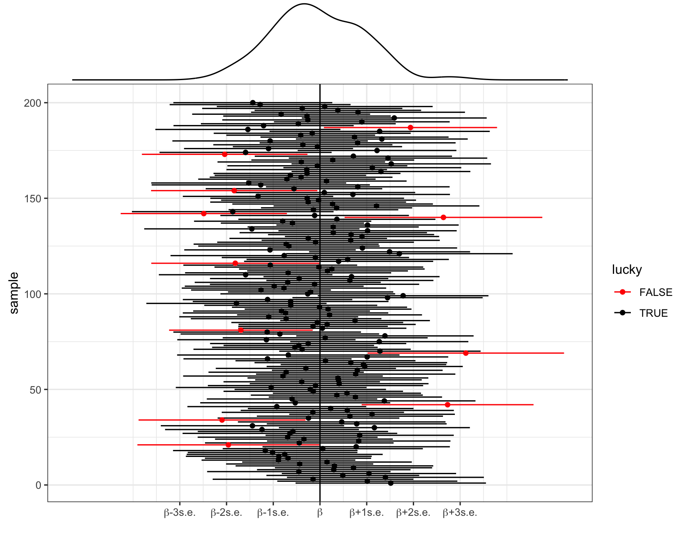

You can download the .qmd file for this activity [here](../activity_templates/20-confidence-intervals.qmd) and open in R-studio. The rendered version is posted in the [course website](https://mutasim221b.github.io/Mac-STAT-155-Sp-26/) (Activities tab). I often experiment with the class activities (and see it in live!) and make updates, but I always post the final version before class starts. To be sure you have the most up-to-date copy, please download it once you’ve settled in before class begins.


```{r setup}
#| include: false
knitr::opts_chunk$set(
  collapse = TRUE, 
  warning = FALSE,
  message = FALSE,
  error = TRUE,
  fig.height = 2.75, 
  fig.width = 4.25,
  fig.env = 'figure',
  fig.pos = 'h',
  fig.align = 'center')
```


# Notes {-}

## Learning goals


::: {.callout-important title = "Statistical superpowers"}

When using our sample data to make estimates about the population, we can do better than providing a single best guess.
We can obtain a *range* of guesses that better captures our understanding and reflects the potential error in our estimate.
This is a **confidence interval**.

:::

By the end of this lesson, you should be able to:

- Construct (approximate) confidence intervals by hand using the 68-95-99.7 rule
- Construct exact confidence intervals in R
- Interpret confidence intervals in context by referring to the coefficient of interest
- Use confidence intervals to make statements about whether there appear to be true population relationships, changes, and differences

## Readings and videos

Please watch the following video and complete the following reading **before** class:

- Video : [Introduction to Confidence Intervals](https://youtu.be/CCgpmFjENwA)
- Reading: Section 7 Introduction, Section 7.1, Section 7.2 (stop when you get to 7.2.4.3 Confidence Intervals for Prediction) in the [STAT 155 Notes](https://mac-stat.github.io/Stat155Notes/)

Optionally you can use the following video as a companion to the reading (not in place of the reading):

- Video 2: [Confidence Intervals: Construction and Interpretation](https://youtu.be/QAbRYk5g8D8)


# Class Notes {-}

# More Notes (Go through after class) {-}

**Set-up**

- $\beta$ = some *population parameter* (e.g. a model coefficient)
- $\hat{\beta}$ = a *sample estimate* of $\beta$
- $\text{s.e.}(\hat{\beta})$ = the *standard error* of $\hat{\beta}$ (essentially the typical error for an estimate calculated from a sample of our size n)


**Central Limit Theorem (CLT): Approximating the sampling distribution**

The collection of possible $\hat{\beta}$ calculated from different samples of size n (i.e. the *sampling distribution* of $\hat{\beta}$) is Normally distributed around $\beta$:

$$
\hat{\beta} \sim N(\beta, \; \text{s.e.}(\hat{\beta})^2)
$$


**What is a Confidence Interval?**

A **confidence interval (CI)** is a plausible range of values used to estimate an unknown population parameter, such as a population mean $\mu$, or a population slope $\beta$ based on data from a random sample. 

Rather than reporting a single point estimate (for example, “the average screen time is 3 hours per day”), a confidence interval provides a range of plausible values together with a chosen confidence level (e.g., $95\%$).


It is important to remember that-

- The true population parameter $\mu$ or $\beta$ is a **fixed but unknown constant**.
The **interval endpoints vary** from sample to sample because they depend on random data.  
  Play this interactive simulation of confidence intervals (Rossman/Chance): <https://www.rossmanchance.com/applets/ConfSim.html>
  
Change the Statsitc to Proportion to Mean and then click on ``Sample"!
**Question:**  
How many times did you observe a confidence interval change from a **green** line to a **red** line when the interval failed to capture the population mean at 0.5?


**Confidence interval for $\beta$**

To *communicate and contextualize* the potential error in $\hat{\beta}$, we can calculate a **confidence interval (CI)** for $\beta$. 
This CI:

- reflects the potential error in $\hat{\beta}$; while
- providing a range of plausible values for $\beta$, i.e. an **interval estimate**; thus
- allows us to draw fair conclusions about the population using data from our sample!

Using the CLT, an *approximate* 95% confidence interval for $\beta$ can be calculated by the formula below.
(More precise calculations are provided in RStudio.)

$$
\hat{\beta} \pm 2 \text{s.e.}(\hat{\beta})
$$


**What does "95% confidence" mean?!**

- Important nuances:
    - $\beta$ is "fixed", i.e. *not* random. There's a fixed, "true" value of $\beta$, we just don't know what it is. Thus we *can't* make probability statements about $\beta$.
    - $\hat{\beta}$ is *random* (it varies from sample to sample, depending upon what sample we happen to get). Thus we *can* make probability statements about $\hat{\beta}$.

- Thus "95% confidence" references the randomness and variability in $\hat{\beta}$ and the interval construction process, not $\beta$: 95% of all possible samples will produce 95% CIs that contain the true $\beta$ value.

- In pictures: 200 different 95% CIs for $\beta$ calculated from 200 different samples. Each sample produces a different estimate $\hat{\beta}$ (dot) hence a different 95% CI for $\beta$ (horizontal line). Roughly 95% of these contain $\beta$ (the black intervals) and roughly 5% do not (the red intervals).




**Interpreting a CI**

Let (a, b) represent the 95% CI for $\beta$.

- Correct: We are *95% confident* that $\beta$ is between a and b.
- Incorrect: There's a *95% chance* that $\beta$ falls between a and b.    
    - Nope! $\beta$ is either in there, or it isn't. No probability involved.
    - It is either in the interval or not, so the probability is 1 or 0.
- Incorrect: There's a 95% chance that sample estimate $\hat{\beta}$ is between a and b.    
    - Nope! We have no uncertainty about $\hat{\beta}$ -- we know exactly what it is and it's *always* in the interval by construction.


# Exercises {-}


**Goals**

- Build up our confidence with confidence intervals (!) by starting with some familiar data and the simple linear regression setting.
- Explore how to use CIs to assess the "significance" of our sample results.


## Exercise 1: Standard errors

In the first set of exercises, we'll explore daily bikeshare ridership.
To begin, let's explore the relationship of `riders_total` by `windspeed` (in mph):

E[`riders_total` | `windspeed`] = $\beta_0$ + $\beta_1$ `windspeed`

A sample *estimate* of this population model, obtained using our sample `bikes` data is below:

E[`riders_total` | `windspeed`] = $\hat{\beta}_0$ + $\hat{\beta}_1$ `windspeed` = 5621.15 - 87.51 `windspeed`

```{r}
# Load packages and import data
library(tidyverse)
bikes <- read_csv("https://mac-stat.github.io/data/bikeshare.csv")
head(bikes)

# Model the relationship
bikes_model_1 <- lm(riders_total ~ windspeed, data = bikes)
coef(summary(bikes_model_1))

# Visualize the relationship
bikes %>% 
  ggplot(aes(y = riders_total, x = windspeed)) + 
  geom_point() + 
  geom_smooth(method = "lm")
```


a. Since $\hat{\beta}_1 = -87.51$, we *estimate* that the expected number of riders decreases by 87.51 for every 1mph increase in windspeed. Report and *interpret* $s.e.(\hat{\beta}_1)$, the *standard error* of this estimate.

b. Considering context, units, and scale of our data (as illustrated in the plot), do you think this is a small, moderate, or large amount of error? (Mainly, do you think our slope estimate is pretty accurate or does the standard error make you skeptical?)


## Exercise 2: Constructing & interpreting a CI

Continue to let $\beta_1$ be the "true" population `windspeed` coefficient, and $\hat{\beta}_1 = -87.51$ be our *sample estimate* of $\beta_1$.

a. $\hat{\beta}_1$ simply provides a *point estimate*, or our single best guess, of $\beta_1$.
To also produce an *interval estimate*, use the 68-95-99.7 Rule to approximate a 95% CI for $\beta_1$.


b. We can calculate a more *accurate* CI by applying the `confint()` function to our *model*.
Your approximation from Part a should be close!

```{r}
confint(bikes_model_1, level = 0.95)
```   


c. *Interpreting* the CI for $\beta_1$ in context requires that we can interpret $\beta_1$ itself! So how can we interpret $\beta_1$ (in general, without assuming a specific value for the unknown $\beta_1$)?

- $\beta_1$ measures the expected number of riders on days with 0mph windspeed
- $\beta_1$ measures the difference in the expected number of riders on days that have a lot of wind vs days that have little wind
- $\beta_1$ measures the change in the expected number of riders for each additional 1mph in windspeed


d. Per the previous exercise: "We are 95% confident that $\beta_1$ is between -61.13 and -113.88".
Interpret this CI in *context*, drawing on your answer to Part a.


## Exercise 3: Misinterpretations

For each of the following **MISINTERPRETATIONS** of a 95% confidence interval (a,b), explain why the statement is a misinterpretation.

- Misinterpretation 1: "There is a 95% probability that the population parameter is within (a,b)."

- Misinterpretation 2: "There is a 5% probability that the population parameter is not within (a,b)."

- Misinterpretation 3: "There is a 95% chance that the sample estimate in (a,b)."


## Exercise 4: Changing the confidence level

Our 95% CI for $\beta_1$ is (-113.88, -61.13).
What would happen if we changed the **confidence level**?!

a. If we lower our confidence level from 95% to 68%, only 68% of samples would produce 68% CIs that cover $\beta_1$.
Intuitively, would the 68% CI be narrower or wider than a 95% CI?    

b. Use the 68-95-99.7 Rule to approximate the 68% CI for $\beta_1$.

c. What if we wanted to be VERY VERY confident that our CI covered $\beta_1$? Use the 68-95-99.7 Rule to approximate the 99.7% CI for $\beta_1$.

d. What if we wanted to be *100%* confident that our CI covered $\beta_1$?!What do you think the CI would have to be?! (Use logic -- the 69-95-99.7 Rule doesn't help in this scenario.)

e. *Check* your answers to Parts b-d using `confint()`.
(Your answers should be close but not exact.)

```{r}
confint(bikes_model_1, level = 0.68)
confint(bikes_model_1, level = 0.997)
confint(bikes_model_1, level = 1)
```     


## Exercise 5: Trade-offs

Summarize the trade-offs in increasing confidence levels, say from 95% to 99.7%, for a CI of some population parameter $\beta$.

a. Choose the correct words for both statements. As confidence level increases...

- the percent of CIs that cover $\beta$...increases / decreases / stays the same; and
- the *width* of the CI...increases / decreases / stays the same.

b. Why is a very wide CI less useful than a narrower CI? For example, what if a pollster reported with 99.7% confidence that the support for "Candidate A" in an upcoming election is between 5% and 85%?

c. Practitioners typically use a 95% confidence level.
Comment on why you think this is.


## Exercise 6: Using CIs to test hypotheses

Recall our population model of in terest:

E[`riders_total` | `windspeed`] = $\beta_0$ + $\beta_1$ `windspeed`

A typical research question here might be whether, among the *population* of days (not just those in our sample), there's a "significant" relationship between ridership and windspeed (i.e. $\beta_1 \ne 0$). Though our sample estimate *suggested* there's a negative relationship ($\hat{\beta}_1 = -87.51$), there's *error* in this estimate. So...does our sample still suggest a relationship after accounting for this potential error?!

a. The *sample model* is plotted below along with *confidence bands* that reflect its potential *error*. Based on this plot alone, what do you think? When accounting for the potential error in our sample model, do we have evidence of a "significant" relationship between ridership and `windspeed`?

```{r}
bikes %>% 
  ggplot(aes(y = riders_total, x = windspeed)) + 
  geom_point() + 
  geom_smooth(method = "lm")
```

b. Recall that our 95% CI for $\beta_1$ was roughly $(-113.88, -61.13)$. Using this CI alone, do we have evidence of a "significant" relationship between hiking `time` and `windspeed`?

c. To answer Parts a and b, you had to make up some "rules" for using plots and CIs to evaluate the significance of $\beta_1$. In general, what were these rules?!

- If (something about the plot), then our sample data provides evidence of a "significant" relationship between Y and X.
- If (something about the CI), then our sample data provides evidence of a "significant" relationship between Y and X.

d. Your work above suggests that there’s a *statistically* significant association between ridership and `windspeed`. This merely suggests that an association *exists* ($\beta_1 \ne 0$). It does *not* necessarily mean that the *magnitude* of the association is *meaningful*, or *practically* significant, in context. Do you think that the association between hiking `riders_total` and `windspeed` is also *practically* significant? Mainly, in the bikeshare context, is the *magnitude* of the association (a decrease between 61.13 and 113.88 riders per 1mph increase in windspeed) actually meaningful?


## Pause 

The exercises below provide more practice with confidence intervals *and* other course concepts: visualizations, model building, logistic regression, causal diagrams, ....
You will likely not get through all of these during class.
That's ok!
Just remember to come back and practice after class.


# Additional Practice

## Exercise 7: More practice

**Research question:** Is the relationship between wind speed (`windspeed`) (in miles per hour) and number of riders (`riders_total`) different across weekdays and weekends?

a. Construct and interpret a visualization that would address this question.

b. Fit a regression model that would address our research question. (Should it be a linear or a logistic regression model?) Interpret only the coefficient of interest.

```{r}
mod_bikes <- ___
```


c. 

- Construct an approximate 95% confidence interval (CI) for the coefficient of interest by hand using the 68-95-99.7 rule.
- Compare your confidence interval to the one given by `confint()` which gives an exact confidence interval. (The columns give the lower and upper ends of the CI for each coefficient.)
- Interpret the exact confidence interval in context.
- Is zero in the interval? Do we have evidence for a real difference in the windspeed-riders relationship across weekends and weekdays?

```{r}
# By hand (you fill in)


# Using confint()
confint(mod_bikes, level = 0.95)
```


d. Let's see if these results agree when looking at adjusted R-squared.

Fit another regression model that does not have the coefficient of interest from your Part b model. Compare the adjusted R-squared values between this model and the Part b model. Explain your findings.


## Exercise 8: Even more practice!

**Research question:** How different is holiday ridership from non-holidays, after accounting for confounding factors?

a. We believe that weather category (`weather_cat`), temperature (`temp_actual`), and wind speed (`windspeed`) confound the relationship of interest.

- Draw a causal graph that shows the 5 variables of interest. Based on your graph do you believe that the 3 potential confounders are indeed confounders (and not mediators or colliders)?
- Construct visualizations that allow you how each potential confounder relates to `riders_total` and to `holiday`.

b. Based on your Part a explorations, fit an appropriate regression model to answer our research question. Interpret only the coefficient of interest.

**A note about scientific notation in R:** Sometimes you may see numbers with the letter `e` in the middle. This is R's way of expressing scientific notation. Whenever you see `e`, replace that with `10 to the power of ...`. So:

- 1.234e+02 is 1.234 x 10^2 = 123.4
- 1.234e-02 is 1.234 x 10^(-2) = 0.01234

c. .

- Use `confint()` to construct a 95% confidence interval for the coefficient of interest.
- Interpret this confidence interval in context.
- Is zero in the interval? Do we have evidence for a real holiday effect on ridership?


## Exercise 9: CIs with logistic regression

The Western Collaborative Group Study (WCGS) was designed in order to investigate a possible link between Type A behavior and coronary heart disease (CHD), and to develop a framework to select patients for intervention in order to decrease risk of CHD. The study contained 3154 cis men between the ages of 39 and 59 in California who had no history of CHD. They were enrolled in the study in 1960 and 1961, underwent a medical examination and covered their medical history, and they were re-examined annually for interim cardiovascular history.

A full codebook is available [here](https://github.com/Mac-STAT/data/blob/main/wcgs_codebook.md). We will focus on the following variables:

- `chd`: Presence (1) or absence (0) of CHD over followup (outcome)
- `tabp`: Presence (1) or absence (0) of Type A behavior (main variable of interest)
- `age`: Age at time of enrollment in the study (years)
- `sbp`: Systolic blood pressure
- `dbp`: Diastolic blood pressure
- `chol`: Cholesterol (mg/dL)
- `ncigs`: Number of cigarettes smoked per day
- `arcus`: Presence (1) or absence (0) of arcus senilis (a colored ring around the cornea made up of lipids like cholesterol and believed to be a risk factor for CHD)
- `bmi`: BMI = weight * 703 / height^2

**Research question:** Is there a causal effect of Type A/B personality on developing coronary heart disease?

```{r}
wcgs <- read_csv("https://mac-stat.github.io/data/wcgs.csv")
```

a. We believe that the following variables are confounders of the relationship between Type A/B personality `tabp` and coronary heart disease (`CHD`): `age + sbp + dbp + chol + ncigs + arcus + bmi`.

Fit a regression model that would address our research question. (Should it be a linear or a logistic regression model?) Interpret only the coefficient of interest.

```{r}
typea_mod <- ___
```

b. 

- Construct a 95% confidence interval for the odds ratio of interest using the following code.
- Interpret the confidence interval in context.
- Is 1 contained in the interval? Why is 1 a relevant value to look for here?

c. 

(On your own time)

The data context in this exercise has a fraught history with the smoking industry. Read [this article](https://www.thecut.com/2016/08/the-tobacco-industry-helped-create-the-type-a-personality.html) for some context about how the Type A personality came to be defined and studied. (One big takeaway: The smoking industry had a large incentive to find something to blame health problems on other than smoking!)


## Reflection

How are you feeling about your ability to translate research questions into appropriate statistical investigations and addressing those questions using output from those investigations? What has gotten easier? What remains challenging?


\
\
\
\


# Solutions {-}

## Exercise 1: Standard errors

```{r eval = TRUE}
# Load packages and import data
library(tidyverse)
bikes <- read_csv("https://mac-stat.github.io/data/bikeshare.csv")

# Model the relationship
bikes_model_1 <- lm(riders_total ~ windspeed, data = bikes)
coef(summary(bikes_model_1))

# Visualize the relationship
bikes %>% 
  ggplot(aes(y = riders_total, x = windspeed)) + 
  geom_point() + 
  geom_smooth(method = "lm")
```

a. Though we *estimate* that the expected ridership decreases by 88 for every additional 1mph in windspeed, we expect that this estimate might be off by 13.4 riders/mph  (that would be the typical error for a sample of this size).
 
b. This is a pretty small error -- we think our slope estimate is pretty accurate. Relative to an estimate of 88 people / mph, being off by 13 people / mph is small both mathematically and contextually.


## Exercise 2: Constructing & interpreting a CI

a. (-114.37, -60.65)

```{r eval = TRUE}
-87.51 - 2*13.43
-87.51 + 2*13.43
```

b. Pretty close! 

```{r eval = TRUE}
confint(bikes_model_1, level = 0.95)
```    

c. $\beta_1$ measures the change in the expected number of riders for each additional 1mph in windspeed

d. We're 95% confident that, for every additional 1mph in windspeed, the expected ridership decreases somewhere between 61 and 114 riders, on average.


## Exercise 3: Misinterpretations

- Misinterpretation 1: "There is a 95% probability that the population parameter is within (a,b)."
    - **Response:** The population parameter is not random. It is either in the interval or not, so the probability is 1 or 0. The 95% means that 95% of random samples (that are representative of the population of interest) are expected to contain the true population parameter---"95% confidence" is describing confidence in the interval construction process.

- Misinterpretation 2: "There is a 5% probability that the population parameter is not within (a,b)."
    - **Response:** This is incorrect for the same reason as the first misinterpretation.

- Misinterpretation 3: "There is a 95% chance that the sample estimate in (a,b)."
    - **Response:** The sample estimate is always in the interval by construction.


## Exercise 4: Changing the confidence level

a. Intuition.

b. (-100.94, -74.08)

```{r eval = TRUE}
-87.51 - 1*13.43
-87.51 + 1*13.43
```

c. (-127.8, -47.22)

```{r eval = TRUE}
-87.51 - 3*13.43
-87.51 + 3*13.43
```

d. Intuition.

e. .

```{r eval = TRUE}
confint(bikes_model_1, level = 0.68)
confint(bikes_model_1, level = 0.997)
confint(bikes_model_1, level = 1)
```   


## Exercise 5: Trade-offs

a. As confidence level increases...

- the percent of CIs that cover $\beta$...increases; and
- the *width* of the CI...increases.

b.  Narrower intervals are more precise. Wide intervals give us too many plausible values to be useful.

c. Partly this is just "tradition" -- people use 95% because that's what people have done for a long time!
It's more likely to cover the actual value than an interval with a lower confidence level (eg: 68%) but narrower, hence more useful / precise, than an interval with a higher confidence level (eg: 99.7%).


## Exercise 6: Using CIs to test hypotheses
    
### Part a

Yes! Any straight line that we can draw within the 95% confidence bands, i.e. the "range" of plausible population models, has a non-0 (specifically positive) slope.

```{r eval = TRUE}
bikes %>% 
  ggplot(aes(y = time, x = windspeed)) + 
  geom_point() + 
  geom_smooth(method = "lm")
```

b. Yes! 0 is not in the interval (the whole CI is above 0), thus is not a plausible value.
Thus even when accounting for the potential error in our sample estimate, it seems there's an association between ridership and windspeed.

c. 

- If a model with a slope of $\beta_1 = 0$ (a straight line) falls outside the confidence bands, then our sample data provides evidence of a "significant" relationship between Y and X.
- If the CI for $\beta_1$ doesn't include 0, then our sample data provides evidence of a "significant" relationship between Y and X.

d. Yes -- considering the scale of ridership and windspeed, the estimated change in ridership with windspeed is meaningful in practice.


## Exercise 7: More practice

```{r eval = TRUE, echo = FALSE}
# Load packages and import data
library(tidyverse)
bikes <- read_csv("https://mac-stat.github.io/data/bikeshare.csv")
```

a. Overall, windier days seem to have less riders (negative slope). The slope for weekends seems slightly steeper than for weekdays, but overall weekdays and weekends have similar slopes.

```{r eval = TRUE}
ggplot(bikes, aes(x = windspeed, y = riders_total, col = weekend)) + 
    geom_point(alpha = 0.2) +
    geom_smooth(method = "lm", se = FALSE) +
    theme_classic() +
    labs(x = "Windspeed (miles per hour)", y = "Total daily riders")
```

b. We need to fit a linear regression model (because outcome is quantitative) with an interaction term to answer this question. The interaction coefficient is of interest. 

Interpretation of interaction coefficient: The average decrease in ridership associated with a 1 mph increase in wind speed is 26.82 rides/mph lower on weekends than for weekdays. Put another way, on weekdays, a 1 mph increase in wind speed is associated with a decrease of 79.47 riders. On weekends, that decrease is 106.29 riders.

```{r eval = TRUE}
mod_bikes <- lm(riders_total ~ windspeed*weekend, data = bikes)
summary(mod_bikes)
```

c. .

> - Our manual calculation is pretty close to the CI given by `confint()`.
> - Interpretation in context:
>   - Preferred interpretation: It is plausible that the true population difference in the relationship between riders and wind speed comparing weekends to weekdays ranges from an average decrease of 84 riders/mph to an average increase of 31.21 riders/mph.
>   - Not as preferred interpretation (but you'll see this wording across disciplines): We are 95% confident that the difference in riders vs. wind speed slopes between weekends and weekdays is between -84 riders/mph to +31.21 riders/mph. (The instructors don't like this interpretation as much because saying "95% confident" is rather vague. We are confident about the interval construction *process* across random samples, and this interpretation doesn't make that clear.)
>
> - Zero is in the CI. This means that the difference in slopes could plausibly be zero. Therefore we do not have evidence for a real difference in the windspeed-riders relationship across weekends and weekdays.

```{r eval = TRUE}
# By hand
-26.82 - 2*29.56
-26.82 + 2*29.56

# By hand using 1.96, which is closer to the exact normal distribution quantile to use
-26.82 - 1.96*29.56
-26.82 + 1.96*29.56

# Using confint()
confint(mod_bikes, level = 0.95)
```


d. 
> - The adjusted R-squared for the interaction model was 0.05332, compared to 0.05355 for the model without the interaction.
> - Adding the interaction term actually **decreased** the adjusted R-squared, suggesting that it didn't really improve the model.
> - This agrees with what our CI interpretation: zero was a plausible value for the difference in slopes. If zero is a plausible value for the difference in slopes, allowing the slopes to be different in our model might not be necessary.

```{r eval = TRUE}
mod_bikes_noint <- lm(riders_total ~ windspeed+weekend, data = bikes)
summary(mod_bikes)
summary(mod_bikes_noint)
```


## Exercise 8: Even more practice!

### Part a


> **Response:** A causal graph might look like below (the double-headed arrows represent lines connecting the variables without a direction of causation). The variables that we're considering putting in the model aren't mediators or colliders. The visualizations support that `weather_cat`, `temp_actual`, and `windspeed` are causes of ridership, but only `weather_cat` and `temp_actual` seem to have noticeable differences between holidays and non-holidays.

```{r eval = TRUE}
dag <- dagitty::dagitty('
dag {
bb="0,0,1,1"
holiday [exposure,pos="0.123,0.550"]
riders_total [outcome,pos="0.668,0.545"]
temp_actual [pos="0.110,0.246"]
weather_cat [pos="0.439,0.260"]
windspeed [pos="0.276,0.157"]
holiday -> riders_total
holiday <-> temp_actual
holiday <-> weather_cat
holiday <-> windspeed
temp_actual -> riders_total
temp_actual -> weather_cat
weather_cat -> riders_total
windspeed -> riders_total
windspeed -> weather_cat
}
')
plot(dag)
```


```{r eval = TRUE}
ggplot(bikes, aes(x = weather_cat, y = riders_total)) +
    geom_boxplot()

ggplot(bikes, aes(x = temp_actual, y = riders_total)) +
    geom_point() +
    geom_smooth()

ggplot(bikes, aes(x = windspeed, y = riders_total)) +
    geom_point() +
    geom_smooth()
```

```{r eval = TRUE}
ggplot(bikes, aes(x = holiday, fill = weather_cat)) +
    geom_bar(position = "fill")

ggplot(bikes, aes(x = holiday, y = temp_actual)) +
    geom_boxplot()

ggplot(bikes, aes(x = holiday, y = windspeed)) +
    geom_boxplot()
```


### Part b


> **Response:** Clear confounders from Part a include `weather_cat` and `temp_actual`. `windspeed` might be a precision variable because it don't seem to be very different between holidays and non-holidays. We try models with just the confounders and with confounders+precision variable. Because temperature has a curved relationships with riders, we include a squared term.
> 
> The coefficient on `holiday` is of interest.
> 
> `mod_bikes_smaller` interpretation: Among days that have the same weather category and temperature, holidays have 731 fewer riders on average than non-holidays.
> 
> `mod_bikes_larger` interpretation: Among days that have the same weather category, temperature, and wind speed, holidays have 725 fewer riders on average than non-holidays.

```{r eval = TRUE}
bikes_new <- bikes %>% 
    mutate(
        temp_actual_squared = temp_actual^2
    )
mod_bikes_smaller <- lm(riders_total ~ holiday + weather_cat + temp_actual_squared, data = bikes_new)
mod_bikes_larger <- lm(riders_total ~ holiday + weather_cat + temp_actual_squared + windspeed, data = bikes_new)

summary(mod_bikes_smaller)
summary(mod_bikes_larger)
```

### Part c

> **Response:** We'll focus on the CI from `mod_bikes_smaller` since the CI from `mod_bikes_larger` is pretty similar.
> 
> - Interpretation in context:
>   - Preferred interpretation: It is plausible that the true population difference in average holiday ridership vs. average non-holiday ridership is from 1371.8 to 90.5 fewer rides on holidays (among days of the same weather category and temperature).
>   - Not as preferred interpretation: We are 95% confident that the population difference in holiday vs non-holiday ridership is between -1371.8 to -90.4532521.
>
> - Zero is not in the CI which means that the difference between holidays and non-holidays (among days of the same weather category and temperature) is *not* plausibly zero. We do have evidence for a true holiday effect.

```{r eval = TRUE}
confint(mod_bikes_smaller, level = 0.95)
confint(mod_bikes_larger, level = 0.95)
```


## Exercise 9: CIs with logistic regression


```{r eval = TRUE}
wcgs <- read_csv("https://mac-stat.github.io/data/wcgs.csv")
```

### Part a


> **Response:** We need to fit a logistic regression model because the `chd` outcome is binary. We include `tabp` as the main predictor of interest and all of the other confounding variables. We need to exponentiate the coefficient so that we're interpreting on the odds scale rather than the log odds scale.
> 
> Interpretation of `exp(tabp)`: Among men of the same age, systolic and diastolic blood pressure, cholesterol levels, smoking habits, history of arcus sinilis, and BMI, those with Type A personality have 1.95 times the odds of CHD than those without Type A personality.

```{r eval = TRUE}
typea_mod <- glm(chd ~ tabp + age + sbp + dbp + chol + ncigs + arcus + bmi, data = wcgs, family = "binomial")
summary(typea_mod)
coef(typea_mod)
exp(coef(typea_mod))
```

### Part b


> **Response:**
> 
> - Interpretation in context:
>   - Preferred interpretation:  Among men of the same age, systolic and diastolic blood pressure, cholesterol levels, smoking habits, history of arcus sinilis, and BMI, it is plausible that those with Type A personality have 1.47 to 2.60 times the odds of CHD than those without Type A personality.
>
> - 1 is not in the CI. 1 is a relevant value to consider for ratios because if the odds ratio is 1, then the (adjusted) odds of CHD is the same in those with Type A and Type B personality. There seems to be a positive relationship between Type A personality and CHD in this study.

```{r eval = TRUE}
confint(typea_mod, level = 0.95) %>% exp()
```


